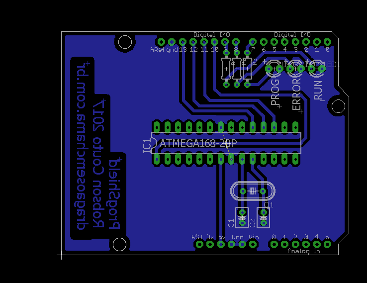

# progshield
A arduino shield for programming ATmegas

## Usage

This uses default pins in Arduino as ISP example.  Just use your favorite way of etching and load the example into your Arduino. This is a single face board and should be easy to make at home.

## Board preview

